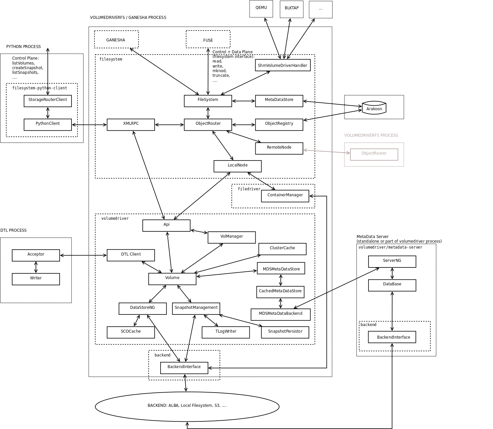

# VolumeDriver Architecture

## Overview

High level description of the control flow for both the data and the control plane. Again, many details are left out (e.g. the asynchronous writing of SCOs and TLogs to the backend via a ThreadPool, most of the Backend code, ....). diagram was created with Dia, the source file is under [docs/volumedriver-90k-ft-view.dia](https://github.com/openvstorage/volumedriver).

## Major Components and Concepts

### Filesystem

* interfaces with FUSE or Ganesha (NFS Server, code for that is under ganesha-filesystem), cf. class FileSystem
* differentiates between the following objects: directories (purely exist as metadata), files and volumes (files with a special suffix)
* filesystem metadata for objects (ownership, timestamps, ...) is kept in Arakoon
* provides a clustering layer: several instances (nodes) expose the same filesystem and hence form a cluster. ObjectRouter as entry point
** each object is owned by exactly one node; accesses from another node are redirected to the owner
** object ownership can be transferred (depending on the number of redirected I/Os a node can ask the owner to transfer the ownership, in case of the owning node being marked as offline another node can steal ownership)
** configuration info about the cluster is stored in Arakoon (ClusterRegistry class as entry point)
* maintains an XMLRPC server which provides an interface for management calls (in addition to the inband management offered by the filesystem interface)

More info in the [VolumeDriver Filesystem](volumedriver_filesystem.md).

### FileDriver

* one backend namespace / bucket per VolumeDriver cluster
* location based
* objects are split into extents (1MiB default size)
* local caching of extents
* extents are currently synchronously put to the backend after writing
* provides distributed access to objects (files and volumes)

More info: [FileDriver Design](filedriver_design.md)

### VolumeDriver

* one backend namespace / bucket per volume
* time based aggregation / log structured approach: all writes are "logged" in SCOs (Storage Container Objects)
* operates at the granularity of a Cluster (4kB)
* mapping from location in volume (ClusterAddress) to location in SCO (ClusterLocation) + MD5 of the Cluster is stored in TLogs and in the MetaDataStore. The former provides history, the latter a quick access to the current mappings
* Snapshots are pointers to TLogs, Clones are volumes that reference SCOs and TLogs of a parent volume up to a certain snapshot (new data is put into their own namespace)
* TLog (and snapshot) information is kept in a separate database (snapshots.xml file) which is also stored in the volume's namespace
* SCOs and TLogs are written asynchronously to the backend by a ThreadPool
** SCOs are considered stored only once the associated TLog (covers several SCOs) is on the backend
** storing a TLog on the backend also requires updating snapshots.xml on the backend
** while these are not safely in the backend yet, the relevant (meta)data is stored in the Distributed Transaction Log (DTL)

#### VolManager

Singleton that
* maintains mappings VolumeId \-> Volume
* owns global components, e.g.
** ReadCache (aka ClusterCache aka ContentBasedCache aka SonOfKak aka ...)
** SCOCache
** ThreadPool for backend access
** BackendConnectionManager
** ...

#### ClusterCache

* global per VolManager
* content based cache of Clusters based on their MD5
* stored in files / block devices ("mountpoints")
* LRU eviction scheme

#### SCOCache

* global per VolManager
* namespaces per volume
* supports several mountpoints (directories)
* SCOs can be disposable (safely stored on the backend) or non-disposable (not yet on the backend)
* LFU eviction
** SCOAccessData is gathered (and also persisted to the backend)
** a cleanup thread periodically checks the available free space per mountpoint; if that is below the trigger gap, disposable SCOs are removed (based on their access frequency) until the backoff gap is met

#### DataStoreNG

* one per Volume
* interfaces Volume with SCOCache
* schedules writing of SCOs via ThreadPool task
* marks SCOs in the SCOCache as disposable once written to the backend

#### MetaDataStore

* one per Volume
* groups entries (mapping from ClusterAddress \-> (ClusterLocation,MD5) into pages
* LRU cache of pages (CachedMetaDataStore) on top of a xMetaDataBackend with x = \{MDS,TokyoCabinet,Arakoon,...\}
* corking: to prevent running ahead of the backend, a cork is placed on TLog creation; updates are not written to the MetaDataBackend but kept in memory; once the TLog is safely on the backend the cork is removed and the updates are written to the backend

#### SnapshotManagement

* one per Volume
* drives TLog writing (via TLogWriter) and snapshots.xml updates (via SnapshotPersistor)
* schedules ThreadPool tasks that put TLogs to the backend

#### Scrubbing

* removal of redundant entries (overwritten data that is not referenced anymore by a snapshot) from SCOs and TLogs
* performed out-of-band:
** scrub work is requested from VolumeDriver
** VolumeDriver is asked to apply scrub results (snapshots.xml, metadata and SCOCache are updated in that case)

#### Volume Restart

* volume configuration information (VolumeConfig, ...) is stored on backend
* local restart
** locally cached metadata (TLogs, tokyocabinet, ...) and data (SCOCache) is reused
* backend restart
** metadata needs to be rebuild from the TLogs in case of a TokyoCabinet backend / not-yet-on-backend data needs to be gotten from the DTL

### MetaDataServer (MDS)

* goal: fault tolerance, faster volume restart (avoid lengthy rebuild from TLogs as much as possible)
* 1 master, 0...n slaves
** master: updated by volume with volume metadata (ClusterAddress -> ClusterLocation mappings)
** slave: periodically updates its state by pulling and playing TLogs from the backend
* details: [ENG:Metadata Server]

### Backend

* resides under backend/
* backend access is currently based on files
* code for streaming (Sinks and Sources, methods in BackendConnectionInterface) exists but is not used at the moment

#### BackendConnection(Interface)

* interface that needs to be implemented for each backend
* current implementations:
** (Amplidata Extreme) REST - uses libcurl and libcurl+\+
** S3 (different flavours are available) - uses webstor library
** Local: uses directory on the filesystem

#### BackendConnectionManager

* maintains a pool of BackendConnections

#### BackendInterface

* bound to a namespace (M:1 mapping, i.e. each BackendInterface accesses a specific namespace but there can be several BackendInterfaces for one namespace)
* adds error handling (retries) on top of BackendConnections obtained from BackendConnectionManager)

#### StorageRouterClient

* resides under filesystem-python-client/
* DSO (Dynamic Shared Object) that provides the management interface to Python

#### ToolCut

* resides under volumedriver/ToolCut/
* DSO that provides a debugging / helper interface to Python, e.g.
** wrappers around the BackendInterface
** tools to inspect TLogs
** ...

