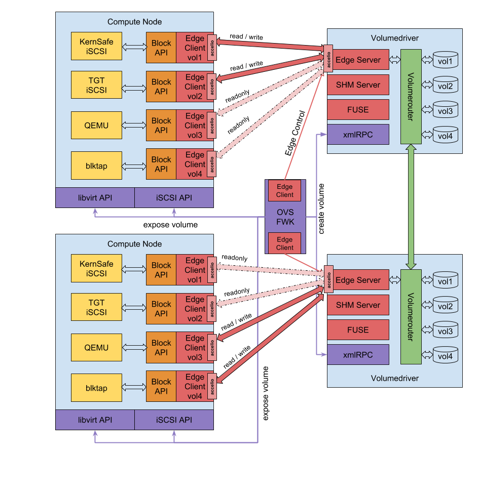

## Edge
The Open vStorage Edge client library offers a block API at the front and in the back connects into the Open vStorage VolumeDriver.

The connection to the VolumeDriver can be done either using a local shared memory interface or a networked based tcp/ip or rdma connection.

